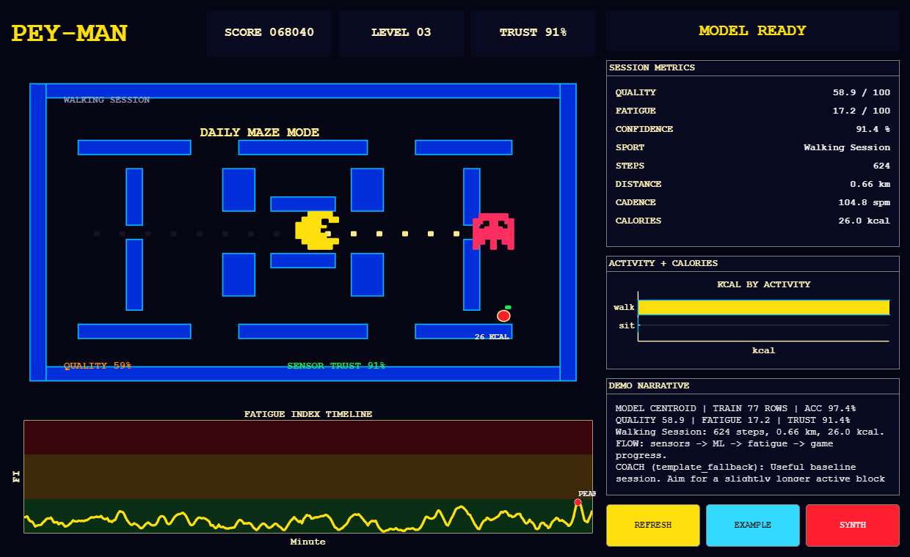

# Pey-Man

> Turn your workout into a Pac-Man game. Pey-Man tracks fitness from MATLAB Mobile sensors and gamifies your progress in a retro Pac-Man pixel UI.

Built for MathWorks Hackathon 2025.

## Demo



## What It Does

- **Activity classification** — sit / walk / run from accelerometer windows, Bagged Trees ensemble with toolbox-free fallback
- **Fatigue Index** — rolling activity-load timeline with annotated peaks
- **Workout Quality Score + Confidence Index** — per-session composite score with model-confidence overlay
- **GPS route + Speed/Altitude** — geoscatter map, haversine distance, speed & altitude vs. time
- **Pac-Man pixel-art UI** — 100% MATLAB `uifigure` (no external assets), neon-arcade theme

## Quick Start

```matlab
% After cloning the repo, from MATLAB:
cd Pey-Man
runPeyManPixelApp          % opens the UI on bundled sample metrics

% Train + classify on a real MATLAB Mobile session:
cd source/pey_man
runLocalDataSession        % expects a .mat under ../../local_data/
```

Bundled sample metrics live under `outputs/<session>/latest_metrics.json` and are
loaded automatically by `runPeyManPixelApp` when no session is passed.

Optional live stream path for MATLAB Online rehearsal:

```matlab
cd Pey-Man
runPeyManLiveStream
```

Live streaming is opt-in. The judged demo path remains `main`,
`runSyntheticFatigueDemo`, and file-based `.mat` replay.
The live UI includes a task dashboard where an operator can enter a target
activity, minutes, calories, and steps; Pac-Man advances when the live stream
meets the task and falls back if the task is ended incomplete.

## MATLAB Online (one-click)

```
https://matlab.mathworks.com/open/github/v1?repo=YURDAKULOGLU/Pey-Man&file=source/pey_man/main.m
```

## Results

- Activity classifier validation accuracy printed by `main.m` at run-time
- IRL session evidence: [docs/testing/IRL_TEST_LOG.md](docs/testing/IRL_TEST_LOG.md)
- Model + data contract: [docs/technical/UI_METRICS_CONTRACT.md](docs/technical/UI_METRICS_CONTRACT.md)

## Repo Layout

- `source/pey_man/` — MATLAB sources (pipeline, classifier, UI, exporter)
- `source/matlab-mobile-fitness-tracker-master/` — starter assets from MathWorks
- `docs/technical/` — algorithm, architecture, data contract, sensor notes
- `docs/testing/` — IRL test runbook + log, test plan
- `docs/project/` — roadmap, demo runbook, goals
- `docs/tr/` — Turkish UI concept & feature notes
- `outputs/` — generated per-session JSON + CSV (gitignored except samples)
- `local_data/` — operator-owned `.mat` recordings (gitignored)
- `tools/` — repo hygiene checks

## Tech Stack

MATLAB R2025b, MATLAB Mobile, MATLAB Online. Statistics & Machine Learning Toolbox preferred; classifier ships with a toolbox-free centroid/rule fallback so the demo runs on a stock install.

## Team

- **YURDAKULOGLU** — model, backend pipeline, repo
- **Mertrenlab** — UI design & polish
- **azadbulut** — data collection & presentation

## Acknowledgments

- Starter: [mathworks/matlab-mobile-fitness-tracker](https://github.com/mathworks/matlab-mobile-fitness-tracker)
- Inspiration: [cheejinteoh/matlabhackathon](https://github.com/cheejinteoh/matlabhackathon) (prior winner)

## License

MIT — see [LICENSE](LICENSE).
